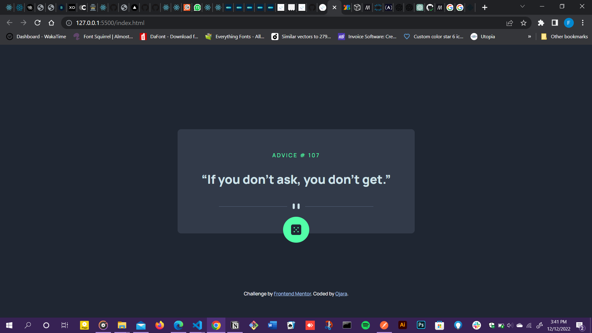

# Frontend Mentor - Advice generator app solution

This is a solution to the [Advice generator app challenge on Frontend Mentor](https://www.frontendmentor.io/challenges/advice-generator-app-QdUG-13db). Frontend Mentor challenges help you improve your coding skills by building realistic projects.

## Table of contents

- [Overview](#overview)
  - [The challenge](#the-challenge)
  - [Screenshot](#screenshot)
  - [Links](#links)
  - [Built with](#built-with)
  - [What I learned](#what-i-learned)
- [Author](#author)

## Overview

### The challenge

Users should be able to:

- View the optimal layout for the app depending on their device's screen size
- See hover states for all interactive elements on the page
- Generate a new piece of advice by clicking the dice icon

### Screenshot
This is what the app looks like

### Links

- Solution URL: [Check out the solution on frontend mentor](https://www.frontendmentor.io/solutions/advice-generator-app-PD_WVKt9hg)
- Live Site URL: [Live Site url](https://frontend-mentor-quotes-generator.netlify.app/)

### Built with

- Semantic HTML5 markup
- CSS custom properties
- Flexbox
-Vanilla javaScript
- CSS Media ueries

### What I learned

I learnt how to use fetch API to fetch data from an external API

## Author

<!-- - Website - [Add your name here](https://www.your-site.com) -->
- Frontend Mentor - [@Ojara27](https://www.frontendmentor.io/profile/Ojara27)
- Twitter - [@ojarraa](https://twitter.com/ojarraa)

